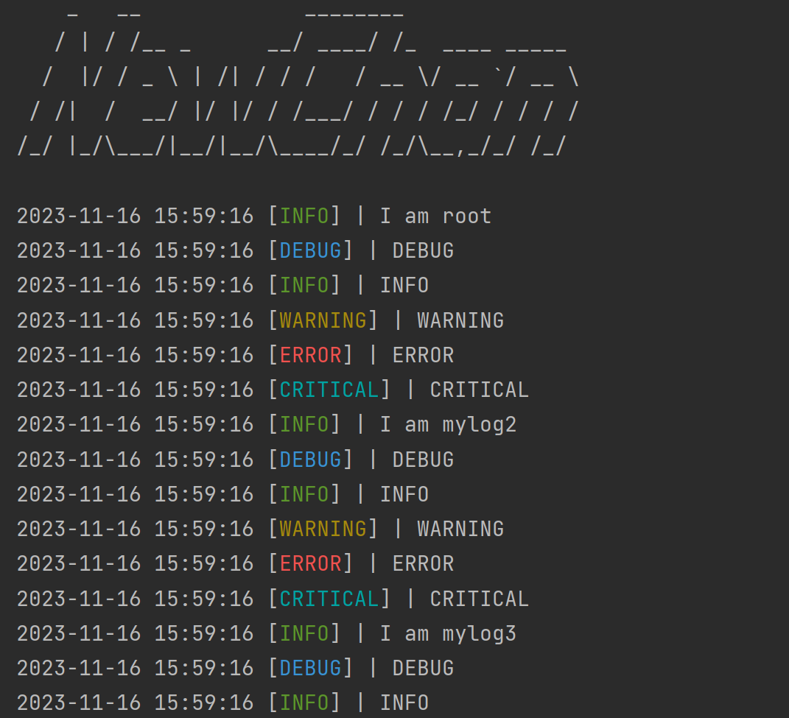

<div align="left">
    <p>
        &nbsp[&nbsp
        <a href="./README.md">中文</a>
        |
        <a href="./README.en-US.md">English</a>
        &nbsp]&nbsp
    </p>
</div>
<div align="center">
    <h1>
        让logging更好
    </h1>
</div>
<details open="open">
<summary>目录</summary>
    <ul>
        <li>
            <a href="#关于项目">关于项目</a>
        	<ul>
                <li><a href="#基础构件">基础构件</a></li>
            </ul>
        </li>
        <li>
            <a href="#快速开始">快速开始</a>
        	<ul>
                <li><a href="#前期准备">前期准备</a></li>
                <li><a href="#使用说明">使用说明</a></li>
            </ul>
        </li>
    </ul>
</details>


## 关于项目

该项目是为了让logging更加的好看一些，因为logging默认的很多设置让输出变得有些奇怪。比如默认使用`sys.stderr`作为输出，这就让输出是红色的警告。等等，使用该项目你还可以制定你自己的logging。

### 基础构件

- Python
- logging

### 效果展示



## 快速开始

clone该项目，将logger文件夹放在你的项目中，并使用`import`来使用。

你还可以自己更改过代码后，使用`pyinstaller`发布你自己的项目，以便可以用pip来随时安装自己的logging。

### 前期准备

在`logger/Logger.py`文件中，已经把所有的颜色代码，log格式代码，日期格式代码准备好了，可以直接引用。

### 使用说明

例如 颜色代码中的前景，上方是颜色对应的code，下方是log等级对应的颜色，更改下方的代码即可。

```
class Foreground:
    BLACK = "30"
    RED = "31"
    GREEN = "32"
    YELLOW = "33"
    BLUE = "34"
    PURPLE = "35"
    CYAN = "36"
    WHITE = "37"

    WARNING = YELLOW
    INFO = GREEN
    DEBUG = BLUE
    CRITICAL = CYAN
    ERROR = RED
```

> 其中Background是特殊的，你需要引用前景的颜色code，否则字体和背景就会混在一起。

接着是log格式代码，该例子中只输出了时间，log等级和信息内容。

```
_fmt = (
    "%(asctime)s "
    "[%(levelname)s]"
    # "[%(name)s]"
    # "(%(filename)s,%(lineno)s)"
    " | %(message)s"
)
```

最后是时间格式代码，这个应该很熟悉了

```
_datefmt = "%Y-%m-%d %H:%M:%S"
```

本项目将所有的log都改为了`sys.stdout`输出，并且将log等级用有颜色的代码输出。

其中这里是log等级的彩色代码，也可以将下面的注释打开，并用上方`levelname`的代码对下方的`asctime`等属性做相同的操作。

```
    def format(self, record):
        if self.use_color:
            levelname = record.levelname
            prefix = f"\033[{getattr(Mode, levelname)};" \
                     f"{getattr(Foreground, levelname)};" \
                     f"{getattr(Background, levelname)}m"
            suffix = f"\033[0m"
            record.levelname = f"{prefix}{levelname}{suffix}"

            # asctime = record.asctime
            # name = record.name
            # filename = record.filename
            # lineno = record.lineno
            # message = record.message
        return super().format(record)
```

最后，你还可以在`logger/__init__.py`文件中定义你自己的logo，可以通过这个[ASCII Generator (network-science.de)](http://www.network-science.de/ascii/)网站来转换你想要的。

```
print("    _   __             ________              \n"
      "   / | / /__ _      __/ ____/ /_  ____ _____ \n"
      "  /  |/ / _ \\ | /| / / /   / __ \\/ __ `/ __ \\\n"
      " / /|  /  __/ |/ |/ / /___/ / / / /_/ / / / /\n"
      "/_/ |_/\\___/|__/|__/\\____/_/ /_/\\__,_/_/ /_/ \n")
```


